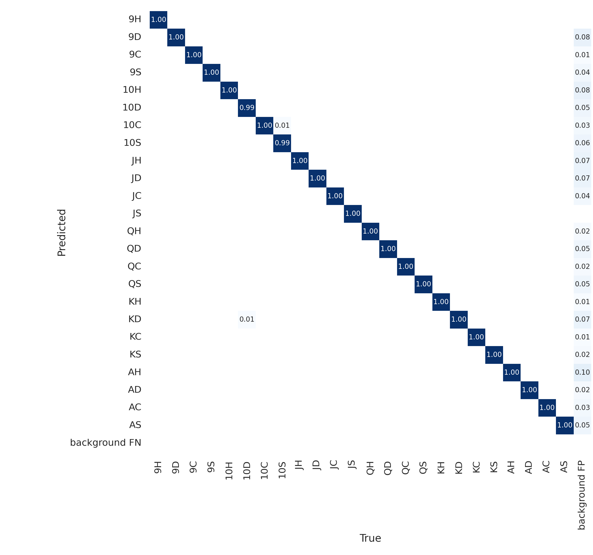
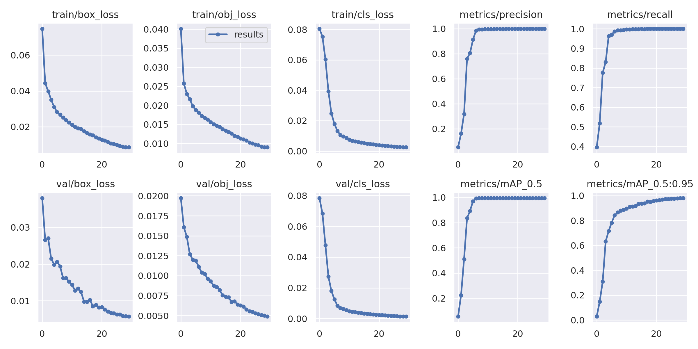

<center><h1>Russian schnapsen detection</h1></center>

Project aims to detect events in a game of [Russian schnapsen](https://en.wikipedia.org/wiki/Russian_Schnapsen). The project is based on [OpenCV](https://opencv.org/) and [Python 3.8](https://www.python.org/) as well as YOLOv5 for object detection. 

YOLOv5 is a object detection model trained on a custom dataset. The dataset can be easily created for your set of playing cards by using repository [playing-cards-detection](https://github.com/Vosloo/playing-cards-detection). 

For this project, three scans of the playing cards are used, each containing 8 cards. which are then extracted and merged into one image with a random background photo. The background dataset can be obtained from [here](https://www.robots.ox.ac.uk/~vgg/data/dtd/).

The model is trained on a dataset of 8,000 generated images with a medium-sized model with a batch-size of 16 and 30 epochs. The model was tested on a set of 2,000 images. The scores of the model are shown below.

<h3>Confusion matrix:</h3>



<h3>Characteristics of the model:</h3>



<br><h2>How to run the project:</h2>
To run this project one needs to execute the main.py file in the src directory. The script has few options including "verbose" to show the output of the program, "source" and "weights" paths (which are mandatory) as well as other options. 

The example of a script execution is as follows:
```
python src/main.py -v info -s data/source.m4v -w data/weights.pt
```
where the -v option is used to show the output of the program, -s option is used to specify the source of the video and -w option is used to specify the weights of the trained model. The paths to the source and weights can be arbitrary.